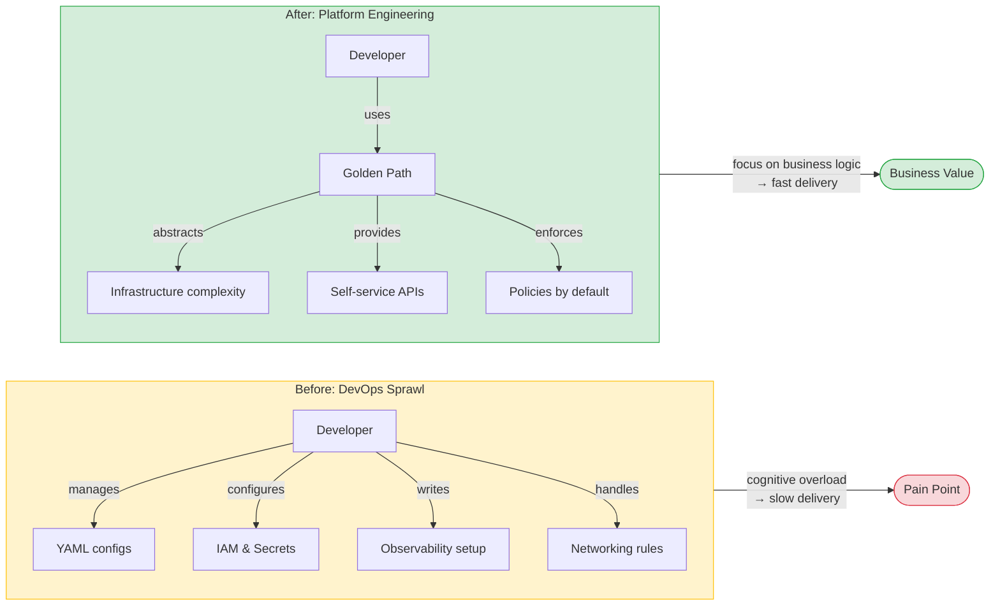
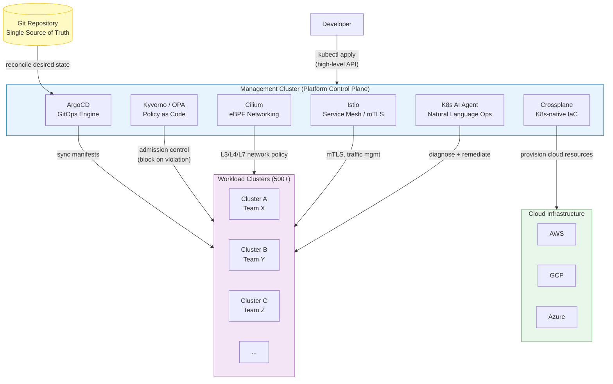
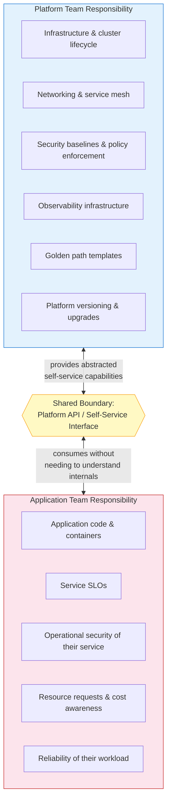

Platform engineering is no longer a forward-looking concept — it is the operational baseline for high-performing engineering organizations in 2026. According to Gartner, 80% of large enterprises are projected to have dedicated platform teams by the end of this year, up from 55% in 2025. But building *a* platform and building *the right* platform are very different problems.

This post distills insights from Akamai's technical leadership on designing a Kubernetes-native Internal Developer Platform (IDP) at scale — 500+ clusters, 8,000+ workloads — and maps those insights to the broader architectural patterns that define mature platform engineering in 2026.
<!--more-->

## Why Platform Engineering Emerged

DevOps gave developers freedom. It also gave them YAML, firewall rules, IAM policies, observability pipelines, and a hundred other things that have nothing to do with the business logic they were hired to build.

The result: cognitive overhead scaled with team size. The more services a company ran, the more each developer had to know about infrastructure just to ship anything. Platform engineering is the correction: treat the platform as a **product**, where internal developers are the customers, and the goal is to let them deploy services without becoming infrastructure specialists.

The mechanism is the **Golden Path** — a paved road of standard patterns, tooling, and automation that makes the right way to deploy a service also the easiest way. Developers self-serve; platform engineers maintain the road.

## Three Architectural Principles

Every design decision in a mature K8s-native platform traces back to three principles. These are not aspirational — they are the enforcement layer that makes everything else work.

### 1. GitOps: Git as the Single Source of Truth

Every piece of infrastructure state, every application configuration, every policy — if it isn't in Git, it doesn't exist. Manual changes to clusters are not just discouraged; they are structurally blocked. The practical consequence: every change is reviewed, every rollback is a revert, and the audit trail is automatic.

At scale (500+ clusters), this is the only mechanism that makes consistency achievable. GitOps tools like ArgoCD continuously reconcile the desired state declared in Git against the actual state running in each cluster — automatically, without human intervention.

### 2. Zero Trust & Policy as Code

Security is a deployment gate, not a post-deployment review. Policy engines like **Kyverno** (Kubernetes-native, YAML-based) and **OPA/Gatekeeper** (Rego-based, suitable for complex cross-cutting rules) intercept every API server request before execution. A workload with a misconfigured security context, a missing resource limit, or a disallowed container registry is rejected at admission — it never touches the cluster.

The 2025–2026 pattern emerging in production environments is a hybrid: Kyverno handles Kubernetes-native mutation and validation policies, while OPA handles complex decision logic that spans multiple resource types or external data sources. Storing these policies in Git alongside application manifests makes them version-controlled and auditable by default.

### 3. Self-Service through Abstraction

Developers interact with the platform through high-level, opinionated APIs — not raw Kubernetes objects. Crossplane's Composite Resource Definitions (XRDs) let platform teams define what "a database" or "a cache" or "a microservice" means in their environment, and developers provision those resources the same way they'd create any Kubernetes object. The infrastructure underneath — cloud provider, region, size, backup schedule — is encoded in the platform, invisible to the consumer.

This abstraction is what separates a platform from a collection of tools.

## The Technology Stack in Practice

**Management Cluster** — the platform team's control plane. This is where all platform tooling runs and from which all workload clusters are governed. It never runs customer workloads.

**ArgoCD** — the reconciliation engine. It watches Git for changes and continuously drives each cluster toward the declared desired state. At 500+ clusters, ApplicationSets allow templated, fleet-wide deployments from a single definition.

**Crossplane** — Kubernetes-native infrastructure provisioning. Think of it as Terraform rebuilt as a Kubernetes controller: you declare a `PostgreSQLInstance` object and Crossplane creates the actual RDS instance (or Cloud SQL, or Azure Database) and wires the credentials back into the cluster as a Secret. Infrastructure becomes part of the same GitOps workflow as application deployments.

**Cilium & Istio** — complementary layers of network security. Cilium operates at the eBPF level (L3/L4) for raw network policy and observability with near-zero overhead. Istio handles L7 concerns: mutual TLS between services, traffic shifting, and fine-grained authorization policies. Together, they provide a complete Zero Trust network posture without requiring application code changes.

**K8s AI Agent** — the emerging layer. Natural-language interfaces to cluster diagnostics are moving from experimental to production-tested. Engineers can query cluster state, triage incidents, and get remediation suggestions without switching context to multiple dashboards. Akamai's 2026 AI infrastructure strategy positions Kubernetes as the runtime for AI workloads, and the same AI tooling is being folded back into the platform to assist operators.

## Platform Versioning: Shipping the Platform Like a Product

The insight that separates mature platforms from tool collections is treating **the platform itself as a versioned, releasable artifact**.

```mermaid
flowchart LR
    subgraph PV["Platform Bundle v2.4"]
        K8S[Kubernetes 1.32]
        PROM[Prometheus 3.x]
        LOKI[Loki 3.x]
        AUTH[Auth stack]
        POL[Policy bundle]
        NET[Networking config]
    end

    subgraph Teams["Application Teams"]
        T1[Team A\nOn v2.4]
        T2[Team B\nOn v2.3]
        T3[Team C\nMigrating v2.3→v2.4]
    end

    subgraph PT["Platform Team"]
        BUILD[Build & test bundle]
        REL[Release notes + migration guide]
        MON[Monitor adoption]
    end

    PT -->|"publishes"| PV
    PV -->|"consumed by"| Teams
    Teams -->|"feedback"| PT

    style PV fill:#e3f2fd,stroke:#1565C0
    style Teams fill:#f3e5f5,stroke:#6A1B9A
    style PT fill:#e8f5e9,stroke:#2E7D32
```

Rather than managing individual tool versions per cluster, platform teams bundle compatible versions of the entire stack — Kubernetes release, Prometheus, Loki, authentication components, policy sets, networking configuration — into a named platform release. Application teams select a platform version, not individual tool versions.

The benefits compound at scale:

- **No compatibility matrix debugging.** Teams inherit a validated combination.
- **Predictable upgrade paths.** Platform teams publish migration guides between versions, not between individual tool releases.
- **Controlled fleet diversity.** At any point, the fleet runs a small number of platform versions, making support tractable.

## The Shared Responsibility Model

A platform only scales when accountability is clearly divided. The model that emerges across high-performing organizations:

The platform team owns the road. The application team owns the car. Neither should be doing the other's job.

This boundary is enforced technically — developers can't modify platform components even if they wanted to — and organizationally, through explicit ownership documentation and on-call boundaries.

## Platform Engineering as AI Infrastructure

One of Akamai's clearest 2026 observations: as AI workloads move into production, the platform becomes the bottleneck or the accelerator, depending on how well it's built.

A poorly designed platform forces AI teams to work around infrastructure constraints, replicating configuration management overhead that application teams already suffer. A well-designed K8s-native platform handles GPU scheduling, distributed inference placement, and AI-specific networking the same way it handles any other workload — through self-service APIs and GitOps-driven deployment, with policy guardrails automatically applied.

The implication: investment in platform engineering now has a multiplier on AI delivery velocity later. The platform is not just for microservices anymore.

## Measuring Success

A platform isn't successful because it uses the right tools. It's successful when the people using it say so and the metrics confirm it.

The signals that matter:

- **Deployment frequency** — are application teams shipping faster after platform adoption?
- **Time to first deployment** for a new service — does the golden path actually reduce onboarding time?
- **Developer satisfaction** — are teams choosing the platform, or working around it?
- **Policy violation rate** — are misconfigurations being caught at admission, or discovered in production incidents?
- **Platform adoption rate** — what percentage of workloads are on a supported platform version?


The DORA metrics provide the objective baseline. If platform adoption isn't moving deployment frequency and change failure rate in the right direction, something in the platform is causing friction rather than removing it.


## Where to Start

If your organization is still at the "we have Kubernetes but every team does their own thing" stage, the path forward isn't to immediately implement all of this. It's to pick the highest-leverage constraint and solve that first.

Typical progression:

1. **Establish GitOps** — get ArgoCD or Flux managing cluster state. Stop manual kubectl apply in production.
2. **Introduce a management cluster** — separate platform concerns from workload concerns.
3. **Add policy enforcement** — start with Kyverno; enforce namespace labels, resource limits, and image registry allowlists.
4. **Build the first golden path** — pick the most common service type your teams deploy and make that path self-service.
5. **Introduce platform versioning** — bundle the stack and start treating platform releases like software releases.

Each step builds the foundation for the next. The goal isn't tooling — it's the experience developers have on the other side of all that tooling.

---

*Insights in this post draw from Akamai's K8s-native IDP design experience (500+ clusters, 8,000+ workloads), CNCF 2026 cloud-native platform engineering guidance, and the 2026 Cloud-Native Developer Survey.*
