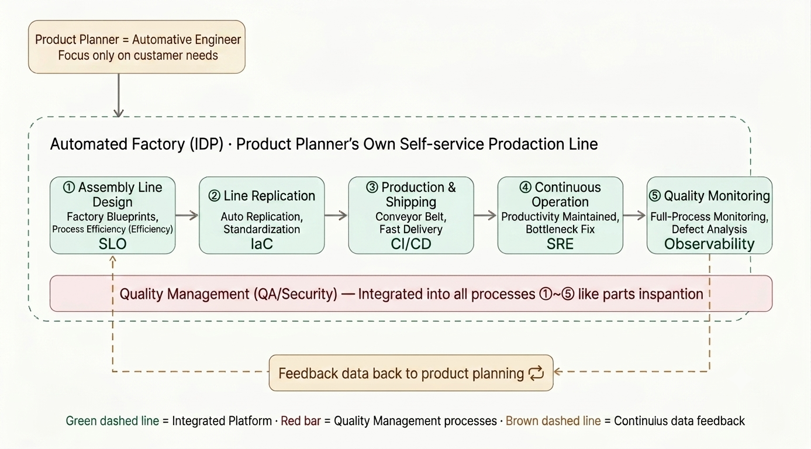

Most engineers have heard platform engineering described as "DevOps, but with a portal." That description undersells what's actually happening. The clearest way to see what a strong Internal Developer Platform (IDP) really does is to stop thinking about it as tooling and start thinking about it as a factory line.
<!--more-->

## From Custom Operator to Self-Service Production Line

A platform team's job looks a lot like building an automated factory: a product planner and an automotive engineer sit down focused entirely on customer needs, and design a line that lets *any* product team manufacture, ship, and operate their own service — without waiting on a specialist to do it by hand every time.

The diagram below maps that factory line directly onto the stages of platform engineering:

## Walking the Line, Station by Station

### 1. Assembly Line Design → SLO

Before you can replicate anything, you need a blueprint: what does "built correctly" mean for this factory line? In platform terms, that blueprint is the **Service Level Objective**. It defines process efficiency and the quality bar every unit coming off the line has to meet — before a single part gets made.

### 2. Line Replication → Infrastructure as Code

Once the blueprint exists, you don't redraw it by hand for every new product. You replicate the line automatically. This is **Infrastructure as Code**: standardized, repeatable environments that let a new service get its own production line in minutes, not weeks of manual setup.

### 3. Production & Shipping → CI/CD

The conveyor belt that actually moves a part from raw material to a shipped product is **CI/CD**. Fast, automated, and the same belt every team uses — so "how do I ship this" stops being a question anyone has to ask a platform engineer.

### 4. Continuous Operation → SRE

A factory line doesn't stop the moment the product ships — someone has to keep the line itself running, watch for bottlenecks, and fix them before they stall production. That's **SRE**: maintaining productivity and resolving bottlenecks in the platform itself, not just in any one service.

### 5. Quality Monitoring → Observability

At the end of the line, every unit gets inspected. **Observability** is that full-process inspection and defect analysis — the platform's way of catching a flaw before it reaches the customer instead of after.

## The Part That Touches Everything: Quality Management

Quality Management (QA/Security) isn't drawn as a station at the end of the line — it's the red bar running underneath stations ① through ⑤. It gets integrated into *every* stage, the same way parts inspection happens continuously on a real assembly line, not just once at final packaging. A platform that bolts security on as a last step before shipping isn't really platform engineering — it's a checklist.

## The Loop That Makes It a Platform, Not Just a Pipeline

The final piece is the brown dashed line: **feedback data flows back to product planning**. A real IDP doesn't just produce services — it produces data about how those services perform, where developers get stuck, and where the line itself needs redesigning. Without that loop, you've built faster shipping. With it, you've built a platform that improves itself.


This is exactly why platform engineering has overtaken plain DevOps tooling as the fastest-growing competency for 2026: a pipeline ships code, but a platform ships a *line* — one that gets better every time it's used.


## Where This Connects in the Playbook

If you're scoring your own platform engineering competency, this factory-line view maps directly onto the proof points in [Platform Engineering & Internal Developer Platforms](/docs/competencies/platform-engineering-idp/): the golden path *is* the blueprint, the IDP portal *is* the replication mechanism, and the feedback loop is exactly what separates a Senior from a Principal on that page's maturity table.
